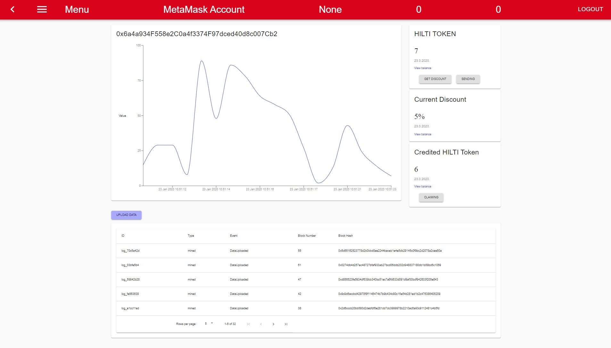

# HILTI IT Competition 2020 - Client

This is a documentation for the client of our solution. The client interacts with the smart contracts of this solution.
It was developed based on the [React Framework](https://reactjs.org/). React is a JavaScript library for creating user interfaces. With React, virtual DOMs and excellent rendering performance are achieved. In addition, it offers a modular component architecture that serves as a basis for modular and easily comprehensible frontend code.

***Important***: The explained functions and structure of the prototype are shown on a high level. For detailed questions please contact the developers!

## Principle Structure
The source code inside the `src` folder consist of the usual files for starting the server and initiating the front-end, as well as additional files to enable the blockchain connection. Most application files are stored in this 4 specific folders: 
> * assets: Background images and stylings.
> * components: Functions for routing an its authentication.
> * containers: Contains most of the functions and frontend data of the prototype.
> * contracts: Migrated SmartContracts including the HILTI-token (ERC20) to interact with the blockchain.

## `containers` Folder

In the following the most important functions and specifications are described and related to the respective files inside the `containers`folder:

### Login.js
The users land on the login page. When starting the application for the first time, the following login credentials should be used to initiate the application:

* **Email: test.test@hilti.com**
* **Password: test**

This generates (as seen in Line 100) all users and tools with specific addresses on the blockchain (calling the smart contract functions `addUser()`, `addTool()`, and `registerTool()`). This was done to enable a nice experience with the prototype without extensive registration proceedures of all tool and users. With that, all demo users and tool are set up as follows:

* **Bob     ->      Hilti Saebelsaegen - WSR 22-A**
* **Tracy   ->      Hilti DD 30-W light diamond drilling machine**
* **Susi    ->      No Tool registered**
* **Paul    ->      No Tool registered**
* **Greg    ->      No Tool registered**
* **Glenn   ->      No Tool registered**

After this, the following logins can be used to test the application (the corresponding code can be seen in line 184 and line 206):

* **Email: bob.foreman@hilti.com**, **Password: bob**

* **Email: tracy.projectlead@hilti.com**, **Password: tracy**

If the login is successful, the user is redirected to the dashboard after his data has been retrieved from the block chain. The user's data structure can be seen in the contract (see `conracts/HiltiContract.sol`). Retrieved parameters are:

* **creditedAmount**
* **currentDiscount**

### Dashboard.js

The following picture shows the dashboard for the viewer. The functions and the graphical interface can be found in the `dashboard` folder in the script `dashboard.js`, whereas the data chart and title is defined in a separate folder called `subContainers`. 

Dashboard Overview: 

Data uploads can be performed by clicking the blue  `Upload data`button. This calls the smart contract functions `uploadData()`, as well as `requestUpload()`. Since data can only be uploaded if a tool requests data, but no real registered tools were implemented in the prototype, the data request automatically happens after each data upload. Therefore, in the current prototype there is no restriction on data uploads. TThe graph of the dashboard shows the history of the data. In the prototype, random values between 0 and 100 are generated. This could then be replaced in a testing environment with different sensor data from the device, such as usage time, acceleration and powerconsumption.  Every time a data upload was performed, a HILTI token is credited to the user.

This shows up on the right side dashboard with three different displays. These are: 

* **Balance of Hilti Tokens of Current Account**
* **Current Discount**
* **Credited Tokens**

The credited tokens show the HILTI tokens that the user can claim by pressing the button `Claiming`.

Below this, the value of the discount he currently gets is shown. To increase the discount, claimed tokens need to be exchanged for this. This can be performed using the `Get Discount` button. With the `Send` button tokens can be also sent to other registered users, in case they don't want to be spent for discounts.

At the bottom of the dashboard a table of all transactions to or from the blockchain is listed. The user can verify the transaction in a transparent manner and has a visualization of the blockchain principles at hand. The following transactions are logged:

* **DataUpload**
* **Claiming**
* **Transfer**

Do not hesitate to explore the sourcecode and ask questions.
